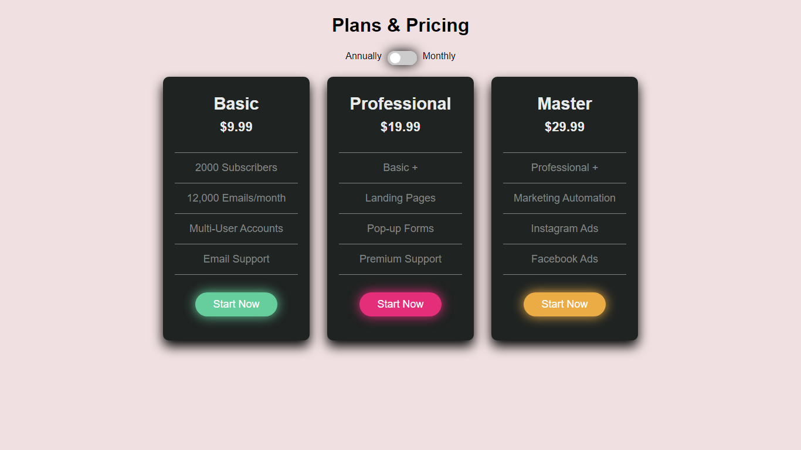

<h1>📦 Front End Collection</h1>

The Front End Collection repository is a compilation of my front-end projects built using HTML and CSS. This collection showcases various interactive and visually appealing web components and applications.It also uses a bit of javascript to log the user's inputed info :3

  - [Account Creation Form](#account-creation-form)
  - [Plan Viewer](#plan-viewer)
  - [Main Page](#main-page)
  - [Calculator](#calculator)

<h2>🎨 Projects:</h2>

<h3 id="account-creation-form">1.📄 Account Creation Form:</h3>
   a beautifully designed account creation form. This form provides a seamless user experience, allowing users to input their information and with a little bit of JavaScript magic we can log the users inputed info  
   

   
----
<h3 id="plan-viewer">2.🔖 Plan Viewer:</h3>
   Dive into the Plan Viewer project, which provides an interface to view different payment plans.  

   

   ----

<h3 id="main-page">3.🏡 Main Page:</h3>
   The Main Page project presents an aesthetically pleasing landing page.  

   

   ----

   
<h3 id="calculator">4.🧮 Calculator:</h3>
   a beautifully designed calculator using css grid that sadly can't calculate anything but it can get user input and show them.  

   

   ----

Feel free to explore the projects, examine the code, and even use them as a foundation for your own creations and let your imagination run wild!

